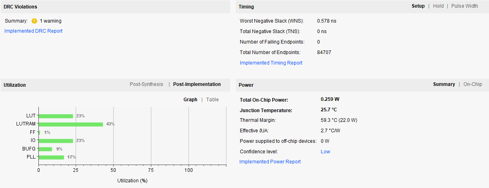

# 0.3 资源使用情况、功耗数据截图（实现后）

老实说，这一个环节的必要性实在是难以恭维。

因为我们学的知识过于浅显，导致经过处理时序约束处理而产生的这些数据具有很低的参考价值。例如 Worst Negative Stack(wns) 表示一个时钟周期内最短的剩余时间，本来可以将其用于计算最大频率（`fMAX = 1/(1/F - wns)`)，但是由于没有处理时序导致其对于计算最大频率没有价值。经过测试，发现上板能够得到的最高频率比通过计算 wns 得到的理论最高频率高出太多（在上板达到最高频率时，wns 通常为较大的负数）。

各种测试都是以 trace 上板的工程来测试，这是因为计算器的汇编中的 load 和 save 指令太少，指令的类型也不全面，而 trace 的汇编就很合适。计算器上板能得到的最高频率也是相当不准的，例如在单周期 CPU 中，计算器上板可以达到 100MHz 的频率，而 trace上板在 50MHz 时就已经失败。

时钟分频设置的有效位数仅限两位，设置的再精确，实际的输出频率也是不准的。例如设置 49.84375MHz，实际输出 50MHz，设置 49.375MHz，实际输出为 49.383MHz。故而没办法也没必要追求测试出精确的最大频率（即使是有两位的有效数字，也不需要将频率设置的精确到两位），所以实验只包含有限的、粗略的几个点。

对于单周期 CPU，实验 25、30、35、40、45、50MHz 的频率；

对于流水线 CPU，实验 50、60、70、80、90、100MHz 的频率。

备注：在提升了频率之后，会出现按下 rst 才能正常跑完 trace 的情况；会出现按下 rst 之后出现不同结果的情况。

何为通过：按下 rst 后得到的结果总是唯一的 2500 0018。反例：2500 0008 和 2500 0018 各 50% 的概率，显然为不通过。

截图：选取 wns 为正数且尽量小的。

## 单周期 CPU

| 频率(MHz) | wns       | 是否通过         | 备注                                                         |
| --------- | --------- | ---------------- | ------------------------------------------------------------ |
| 25        | 4.718ns   | 是               |                                                              |
| 30        | 0.433ns   | 是               |                                                              |
| 35        | -0.181ns  | 是               |                                                              |
| 40        | -3.338ns  | 尚未按照要求测试 |                                                              |
| 45        | -6.419ns  | 尚未按照要求测试 |                                                              |
| 50        | -10.981ns | 否               | 第一次显示 0000 0000，按下 rst 后大概率显示 2500 0018，小概率显示 2500 0008 |

很不幸的是，实验室的板子已经被收走了，无法继续上板实验，没能测出最大频率。

截图：（30MHz）

## 流水线 CPU

| 频率(MHz) | wns      | 是否通过         | 备注                                                         |
| --------- | -------- | ---------------- | ------------------------------------------------------------ |
| 50        | 4.16ns   | 是               |                                                              |
| 60        | 0.578ns  | 尚未按照要求测试 |                                                              |
| 70        | -0.132ns | 尚未按照要求测试 |                                                              |
| 80        | -2.056ns | 尚未按照要求测试 |                                                              |
| 90        | -2.781ns | 尚未按照要求测试 |                                                              |
| 100       | -3.944ns | 否               | 第一次显示 0000 0000，按下 rst 后大概率显示 2500 0018，小概率显示 2500 0008 |

截图：（60MHz）

## extra

在这个小小的问题上不该纠结这么长的时间，一方面缺乏继续优化的知识，一方面没有这样的精力。

一个小惊喜是，如果你不加上 clock.xdc 就跑完综合实现的话，功耗这一栏的值会相当的大——很有意思。
