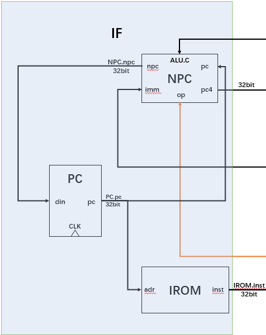
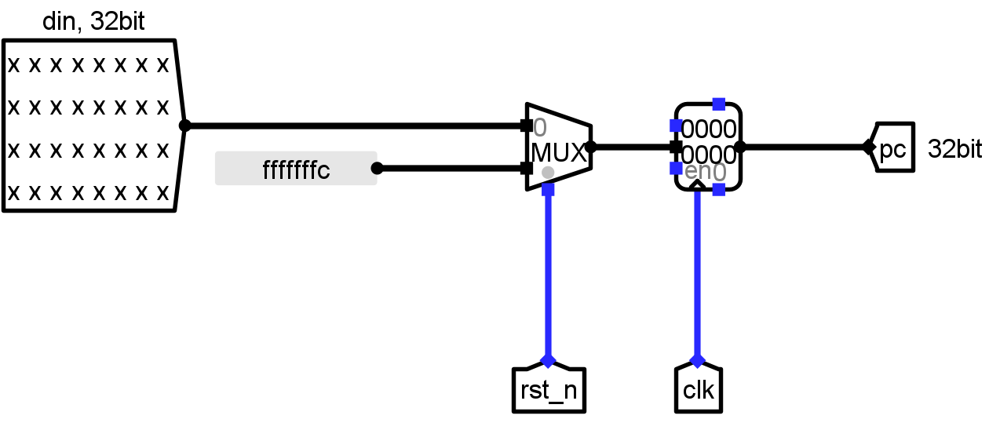
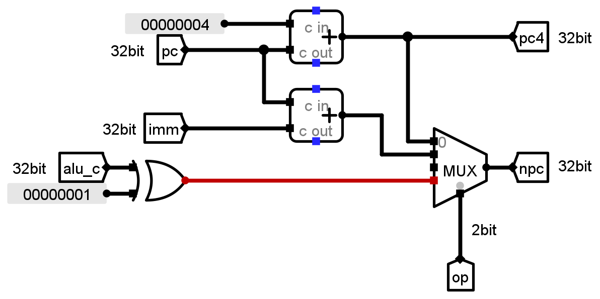
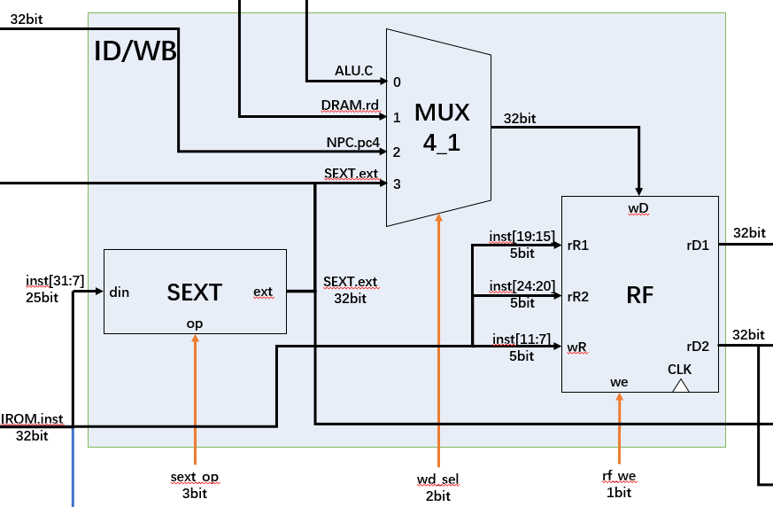
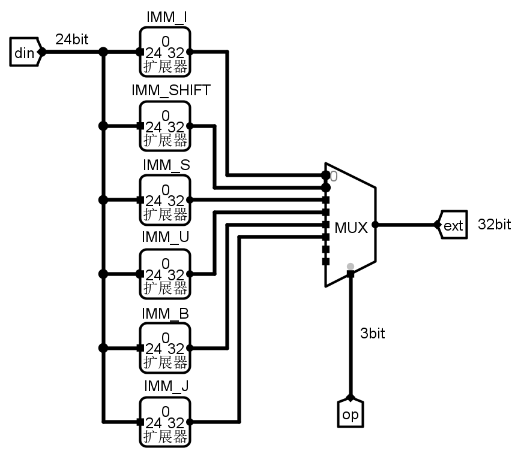
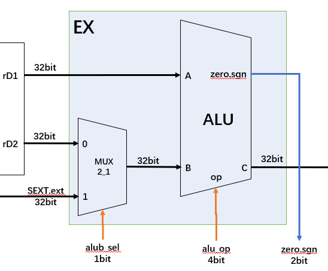
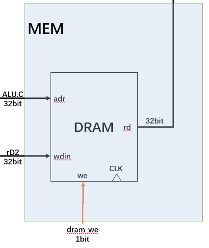
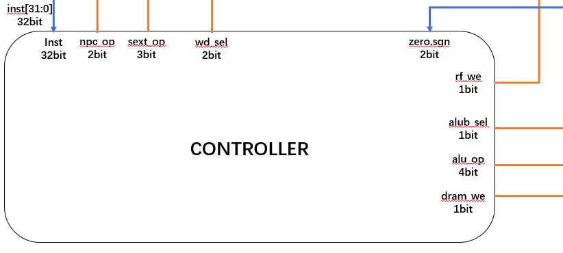

# 1.2 单周期 CPU 模块详细设计

（要求：各个模块的详细设计图，要包含内部的子模块，以及关键性逻辑，标出信号名和位宽，并有详细说明）

## 取指模块

IROM：指令存储器，根据 pc 值得到对应的指令。

PC：在时钟上升沿，若 ~rst_n 为 0，则寄存器更新为输入 pc 值 din；若 ~rst_n 为 1，则寄存器初始化为 -4。

NPC：根据 op 控制信号决定 npc 的输出。npc 共有三个来源，分别为 pc + 4、 pc + imm、rd1 + imm。

同时，输出后续计算所需数据：pc + 4。

异或运算的用途：使一个数的最低位为零。

如：使 a 的最低位为 0，可以表示为：a & ~ 1。~1 的值为 1111 1111 1111 1110，再按 "与" 运算，最低位一定为 0。因为 "~" 运算符的优先级比算术运算符、关系运算符、逻辑运算符和其他运算符都高。

## 译指/写回模块

SEXT：立即数扩展单元，根据控制信号对指令中的立即数进行扩展。

（数据的拼接过于复杂故图略）

RF：

对 32 位指令 inst 进行解析，得到两个读取地址 rR1、rR2 和一个写入地址 wR，通过组合逻辑读出对应地址信号 rD1(RF[rR1])、rD2(RF[rR2])。

寄存器的读没有时钟限制，可以直接读取。但是会在时钟上升沿写入，并且对于写有一定的要求，主要是为了达成零号寄存器读出的值为 0，且不管写入零号寄存器的数据为多少，总是只能写入 0 或者无法写入的目的：

- 只有在写使能为 1 且写入寄存器号为不为 0 的情况下，我们会把写入的数据 wD 写入对应的寄存器；
- 此外的情况，只会完成想向零号寄存器里写入 0 的操作。

MUX4_1：多路选择器，选择写入 RF 的数据。其写入数据通过四选一选择器对数据进行选择，其写入数据包括：运算器结果 ALU.C、存储器读出结果 DRAM.rd、pc + 4、拓展后的立即数 SEXT.ext，由 wb_sel 信号决定写入数据，由 rf_we 信号决定是否写入。

## 运算模块

MUX2_1：选择器，选择写入 ALU.B 端口的数据。

ALU：进行各种运算，并根据 alu_op 选择所需的运算结果。其中包括加、减、按位与、按位或、按位异或、逻辑右移、逻辑左移、算术右移运算模块。输出计算结果是否为 0，以及正负数的信号。

（SUB 计算的部分简化了，本来应该是 A + (~B) + 1）

## 存储模块

DRAM：数据存储器，用于存储数据。

## 控制器模块

CONTROLLER：控制器，根据指令生成各个器件的控制信号。

（具体图略）

输入其一是 32 位的指令，但实际上输入也可以是分开的，例如 在外部就分出 opcode、funct3、funct7，不仅如此，还可以不需要 opcode 的最后一位，这样的好处是不传递没用的位数，在综合实现的时候可以少报出 warning。不过目前我仍然采取的是传递完整的 inst。

根据 opcode、funct3、funct7，控制器总共会生成 npc_op，sext_op，wd_sel，rf_we，alub_sel，alu_op，dram_we 这七个控制信号。其中，npc_op 的生成还需要 ALU 传递来的 zero 和 sgn。

具体的生成逻辑见代码文件。

