# 1.3 单周期 CPU 仿真及结果分析

（要求：包含逻辑运算指令、访存指令、跳转指令的仿真截图，以及结果分析）

- add，from add.dump

```asm
00000004 <reset_vector>:
   4:	00000093          	addi	x1,x0,0
   8:	00000113          	addi	x2,x0,0
   c:	00208733          	add	x14,x1,x2
  10:	00000393          	addi	x7,x0,0
  14:	00200193          	addi	x3,x0,2
  18:	4c771663          	bne	x14,x7,4e4 <fail>
```

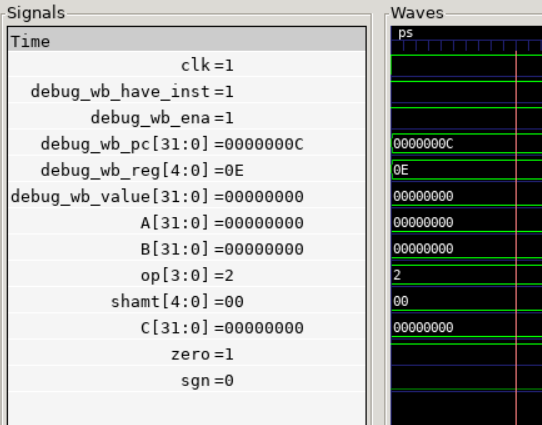

pc = c，x1 = 0，x2 = 0，x14 = x1 + x2 = 0。

- sub，from sub.dump

```asm
0000001c <test_3>:
  1c:	00100093          	addi	x1,x0,1
  20:	00100113          	addi	x2,x0,1
  24:	40208733          	sub	x14,x1,x2
  28:	00000393          	addi	x7,x0,0
  2c:	00300193          	addi	x3,x0,3
  30:	48771a63          	bne	x14,x7,4c4 <fail>
```

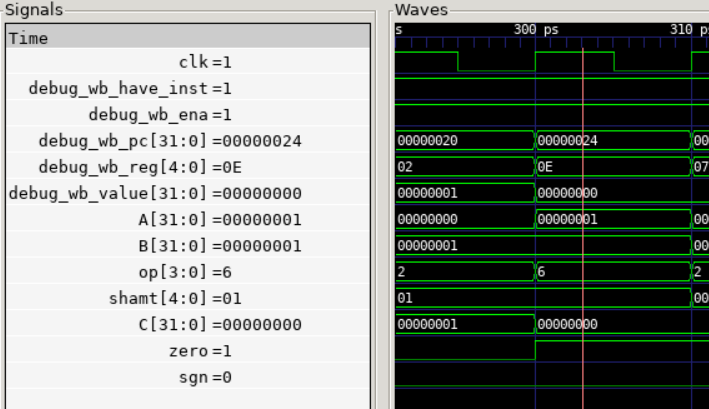

pc = 24，x1 = 1，x2 = 1，x14 = x1 - x2 = 0。

- and，from and.dump

```asm
0000004c <test_4>:
  4c:	00ff00b7          	lui	x1,0xff0
  50:	0ff08093          	addi	x1,x1,255 # ff00ff <_end+0xfee0ff>
  54:	0f0f1137          	lui	x2,0xf0f1
  58:	f0f10113          	addi	x2,x2,-241 # f0f0f0f <_end+0xf0eef0f>
  5c:	0020f733          	and	x14,x1,x2
  60:	000f03b7          	lui	x7,0xf0
  64:	00f38393          	addi	x7,x7,15 # f000f <_end+0xee00f>
  68:	00400193          	addi	x3,x0,4
  6c:	44771863          	bne	x14,x7,4bc <fail>
```

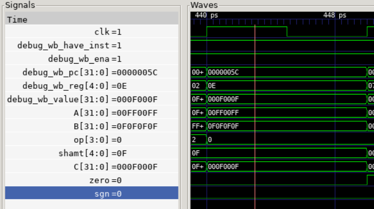

pc = 5c，x1 = 00ff 00ff，x2 = 0f0f 0f0f，x14 = x1 & x2 = 000f 000f。

- or，from or.dump

```asm
00000070 <test_5>:
  70:	f00ff0b7          	lui	x1,0xf00ff
  74:	00f08093          	addi	x1,x1,15 # f00ff00f <_end+0xf00fd00f>
  78:	f0f0f137          	lui	x2,0xf0f0f
  7c:	0f010113          	addi	x2,x2,240 # f0f0f0f0 <_end+0xf0f0d0f0>
  80:	0020e733          	or	x14,x1,x2
  84:	f0fff3b7          	lui	x7,0xf0fff
  88:	0ff38393          	addi	x7,x7,255 # f0fff0ff <_end+0xf0ffd0ff>
  8c:	00500193          	addi	x3,x0,5
  90:	42771c63          	bne	x14,x7,4c8 <fail>
```

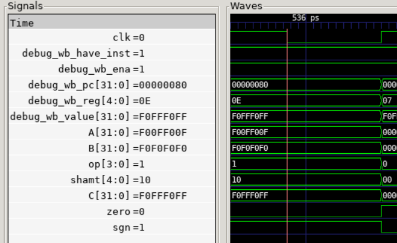

pc = 80，x1 = f00f f00f，x2 = f0f0 f0f0，x14 = x1 | x2 = f0ff f0ff。

- xor，from xor.dump

```asm
00000094 <test_6>:
  94:	ff0100b7          	lui	x1,0xff010
  98:	f0008093          	addi	x1,x1,-256 # ff00ff00 <_end+0xff00df00>
  9c:	0f0f1137          	lui	x2,0xf0f1
  a0:	f0f10113          	addi	x2,x2,-241 # f0f0f0f <_end+0xf0eef0f>
  a4:	0020c0b3          	xor	x1,x1,x2
  a8:	f00ff3b7          	lui	x7,0xf00ff
  ac:	00f38393          	addi	x7,x7,15 # f00ff00f <_end+0xf00fd00f>
  b0:	00600193          	addi	x3,x0,6
  b4:	40709863          	bne	x1,x7,4c4 <fail>
```

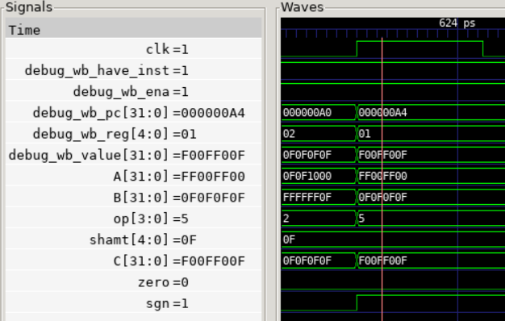

pc = a4，x1 = ff00 ff00，x2 = 0f0f 0f0f，x1 = x1 ⊕ x2 = f00f f00f。

- sll，from sll.dump

```asm
0000007c <test_7>:
  7c:	fff00093          	addi	x1,x0,-1
  80:	00000113          	addi	x2,x0,0
  84:	00209733          	sll	x14,x1,x2
  88:	fff00393          	addi	x7,x0,-1
  8c:	00700193          	addi	x3,x0,7
  90:	4c771263          	bne	x14,x7,554 <fail>
```

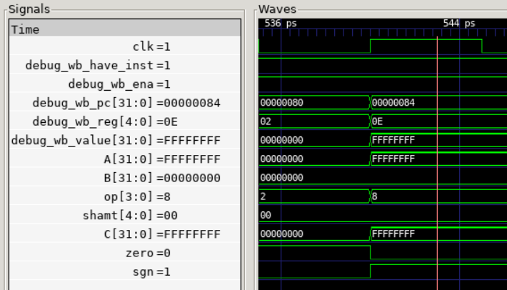

pc = 84，x1 = ffff ffff，x2 = 0，x14 = x1 << x2 = ffff ffff << 0 = ffff ffff。

- sra，from sra.dump

```asm
000000a0 <test_8>:
  a0:	800000b7          	lui	x1,0x80000
  a4:	fff08093          	addi	x1,x1,-1 # 7fffffff <_end+0x7fffdfff>
  a8:	00100113          	addi	x2,x0,1
  ac:	4020d733          	sra	x14,x1,x2
  b0:	400003b7          	lui	x7,0x40000
  b4:	fff38393          	addi	x7,x7,-1 # 3fffffff <_end+0x3fffdfff>
  b8:	00800193          	addi	x3,x0,8
  bc:	4e771263          	bne	x14,x7,5a0 <fail>
```


pc = ac，x1 = 7fff ffff，x2 = 1，x14 = x1 >>> x2 = 7fff ffff >>> 1 = 3fff ffff。

- srl，from srl.dump

```asm
000000b4 <test_9>:
  b4:	fff00093          	addi	x1,x0,-1
  b8:	00700113          	addi	x2,x0,7
  bc:	0020d733          	srl	x14,x1,x2
  c0:	020003b7          	lui	x7,0x2000
  c4:	fff38393          	addi	x7,x7,-1 # 1ffffff <_end+0x1ffdfff>
  c8:	00900193          	addi	x3,x0,9
  cc:	4a771e63          	bne	x14,x7,588 <fail>
```

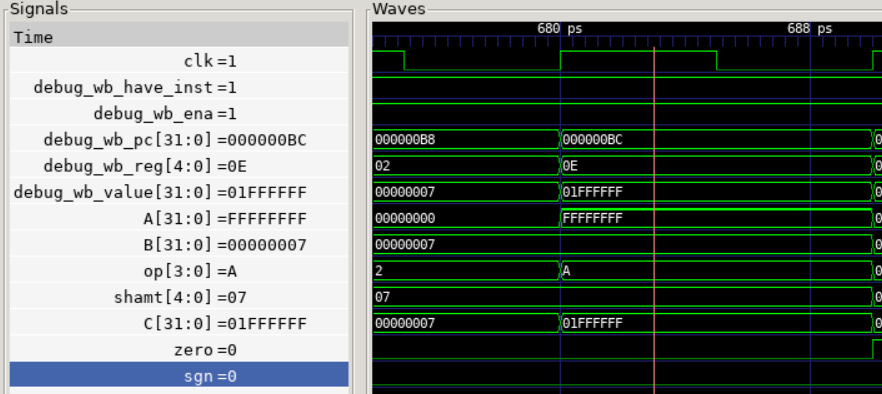

pc = bc，x1 = ffff ffff，x2 = 7，x14 = x1 >> x2 = ffff ffff >> 7 = 01ff ffff。

- 访存指令，from sw.dump

```asm
00000144 <test_10>:
 144:	000020b7          	lui	x1,0x2
 148:	02008093          	addi	x1,x1,32 # 2020 <tdat9>
 14c:	12345137          	lui	x2,0x12345
 150:	67810113          	addi	x2,x2,1656 # 12345678 <_end+0x12343648>
 154:	fe008213          	addi	x4,x1,-32
 158:	02222023          	sw	x2,32(x4) # 20 <reset_vector+0x1c>
 15c:	0000a283          	lw	x5,0(x1)
 160:	123453b7          	lui	x7,0x12345
 164:	67838393          	addi	x7,x7,1656 # 12345678 <_end+0x12343648>
 168:	00a00193          	addi	x3,x0,10
 16c:	30729e63          	bne	x5,x7,488 <fail>
```


x1 = 0000 2020，x2 = 1234 5678，x4 = 0000 2000；

把 x2 的值存到基地址 0000 2000，偏移 32 的地址，即 0000 2020；

读取基地址 0000 2020，偏移 0 的地址，即 0000 2020 到 x5 中。

那么 x5 = 12345678。

x7 = 12345678，x5 == x7，故而不满足 bne，不跳转，可以注意到 pc = 164 后是 pc = 168，故没有发生跳转，对应正确。

- jal，from jal.dump

```asm
00000000 <_start>:
   0:	0040006f          	jal	x0,4 <reset_vector>

00000004 <reset_vector>:
   4:	00200193          	addi	x3,x0,2
   8:	00000093          	addi	x1,x0,0
   c:	0100026f          	jal	x4,1c <target_2>

00000010 <linkaddr_2>:
  10:	00000013          	addi	x0,x0,0
  14:	00000013          	addi	x0,x0,0
  18:	03c0006f          	jal	x0,54 <fail>

0000001c <target_2>:
  1c:	01000113          	addi	x2,x0,16
  20:	02411a63          	bne	x2,x4,54 <fail>
```

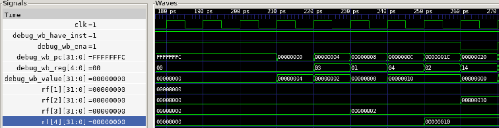

第一个 jal 指令没有什么作用，从可以正常到 pc = 4 看出没有问题；

第二个 jal 指令会向 x4 存储 pc + 4，即 10，跳转到 pc = 1c，也没有问题。

- jalr，from jalr.dump

```asm
00000004 <reset_vector>:
   4:	00200193          	addi	x3,x0,2
   8:	00000293          	addi	x5,x0,0
   c:	01800313          	addi	x6,x0,24
  10:	000302e7          	jalr	x5,0(x6)

00000014 <linkaddr_2>:
  14:	0c40006f          	jal	x0,d8 <fail>

00000018 <target_2>:
  18:	01400313          	addi	x6,x0,20
  1c:	0a629e63          	bne	x5,x6,d8 <fail>
```

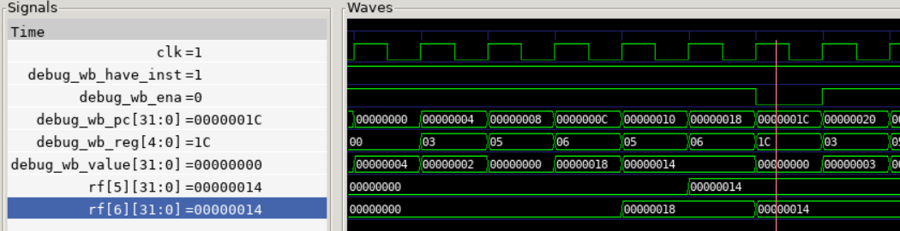

x6 = 18(16 进制)

jalr 指令使 x5 = 14(16 进制)，跳转到 pc = 18(16 进制)，没问题；

x6 = 14(16 进制)

x5 == x6，不满足 bne，不跳转，没问题。

- beq、bne，from beq.dump

```asm
00000004 <reset_vector>:
   4:	00200193          	addi	x3,x0,2
   8:	00000093          	addi	x1,x0,0
   c:	00000113          	addi	x2,x0,0
  10:	00208663          	beq	x1,x2,1c <reset_vector+0x18>
  14:	2a301863          	bne	x0,x3,2c4 <fail>
  18:	00301663          	bne	x0,x3,24 <test_3>
  1c:	fe208ee3          	beq	x1,x2,18 <reset_vector+0x14>
  20:	2a301263          	bne	x0,x3,2c4 <fail>
```

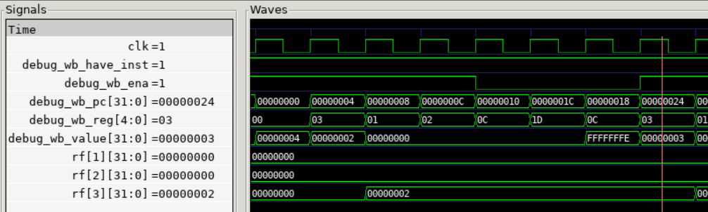

x3 = 2，x1 = 0，x2 = 0；

pc = 10：x1 == x2，满足 beq，跳转到 pc = 1c；

pc = 1c：x1 == x2，满足 beq，跳转到 pc = 18；

pc = 18：x0 != x3，满足 bne，跳转到 pc = 24。

- blt

```asm
00000004 <reset_vector>:
   4:	00200193          	addi	x3,x0,2
   8:	00000093          	addi	x1,x0,0
   c:	00100113          	addi	x2,x0,1
  10:	0020c663          	blt	x1,x2,1c <reset_vector+0x18>
  14:	2a301863          	bne	x0,x3,2c4 <fail>
  18:	00301663          	bne	x0,x3,24 <test_3>
  1c:	fe20cee3          	blt	x1,x2,18 <reset_vector+0x14>
  20:	2a301263          	bne	x0,x3,2c4 <fail>
```

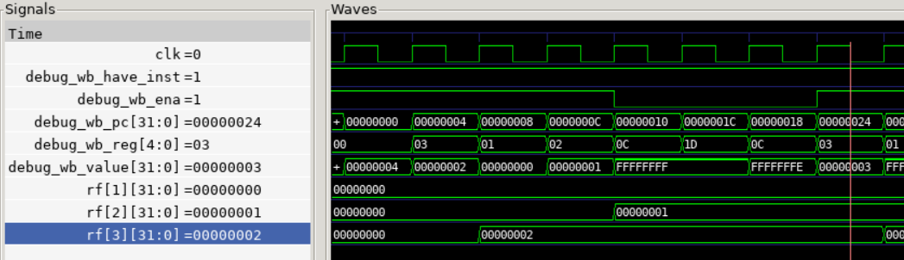

x3 = 2，x1 = 0，x2 = 1；

pc = 10：x1 < x2，满足 blt，跳转到 pc = 1c；

pc = 1c：x1 < x2，满足 blt，跳转到 pc = 18；

pc = 18：x0 != x3，满足 bne，跳转到 pc = 24。

- bge

```asm
00000004 <reset_vector>:
   4:	00200193          	addi	x3,x0,2
   8:	00000093          	addi	x1,x0,0
   c:	00000113          	addi	x2,x0,0
  10:	0020d663          	bge	x1,x2,1c <reset_vector+0x18>
  14:	30301863          	bne	x0,x3,324 <fail>
  18:	00301663          	bne	x0,x3,24 <test_3>
  1c:	fe20dee3          	bge	x1,x2,18 <reset_vector+0x14>
  20:	30301263          	bne	x0,x3,324 <fail>
```

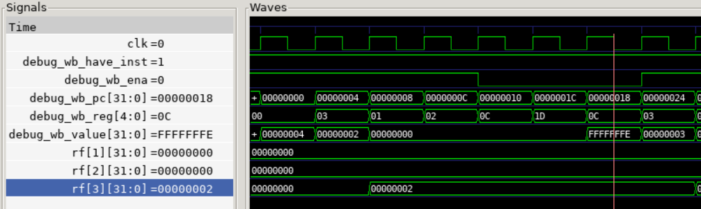

x3 = 2，x1 = 0，x2 = 0；

pc = 10：x1 >= x2，满足 bge，跳转到 pc = 1c；

pc = 1c：x1 >= x2，满足 bge，跳转到 pc = 18；

pc = 18：x0 != x3，满足 bne，跳转到 pc = 24。

