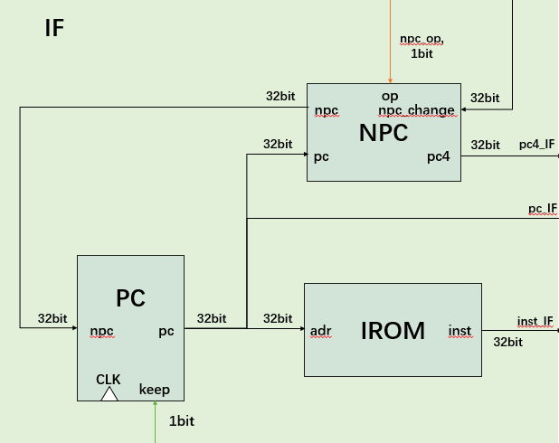
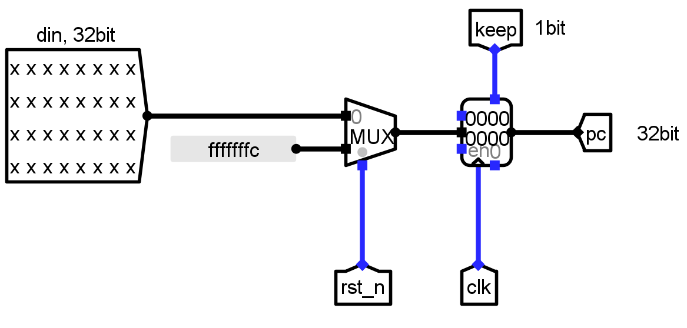
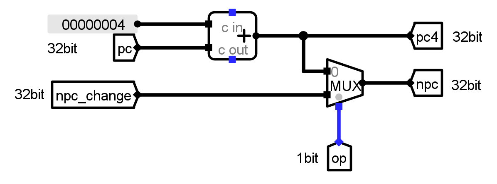
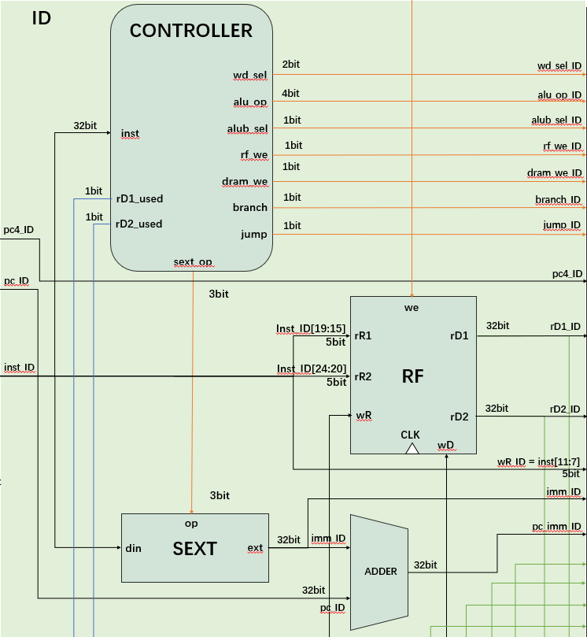
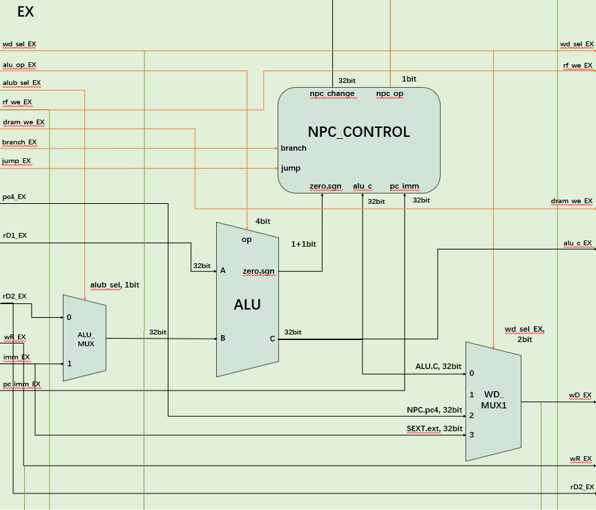
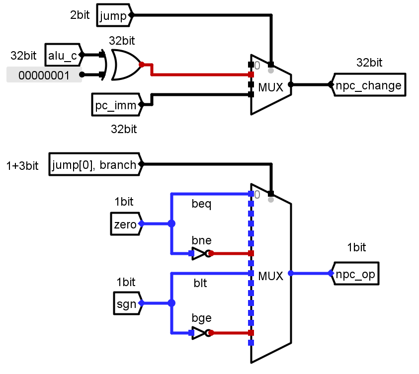
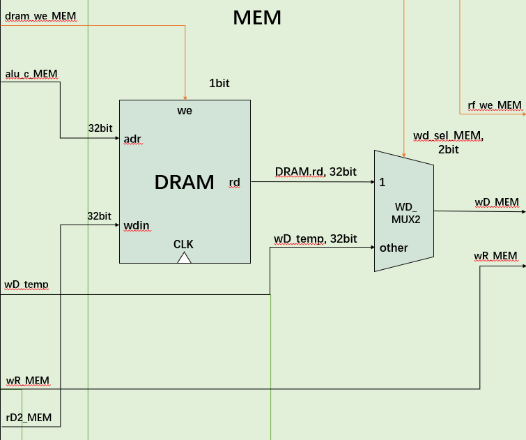
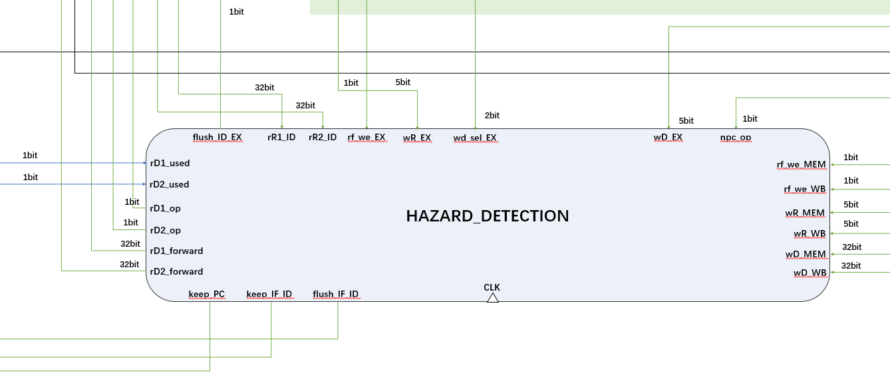

# 2.3 流水线 CPU 模块详细设计

（要求：各个模块的详细设计图，要包含内部的子模块，以及关键性逻辑，标出信号名和位宽，并有详细说明；数据冒险与控制冒险的解决方法必须要详细说明）

## 取指模块



PC：更新当前 pc 值；当控制信号 keep 为 1 时保持寄存器内容在下一个时钟周期不变。



NPC：得到下一条指令的 pc 值；当控制信号 op 为 0 时，npc 输出为当前 pc + 4，op 为 1 时，npc 输出为 EX 阶段来的指定要跳转的 pc 值。故而 op 也是跳转的标志。



IROM 模块与单周期中相应模块原理相同。

## 译指模块



CONTROLLER：控制器，根据指令生成各个器件的控制信号。和单周期数据通路的控制器不同，由于生成 npc_op  所需要的 zero 和 sgn 要到 EX 阶段才能得到，故转而生成判断 jal/jalr 和 B 型指令的控制信号 jump 和 branch，传到 EX 阶段，到那时再做处理。

SEXT 和 RF 模块与单周期中相应模块原理相同。

## 执行模块



ALU_MUX 和 ALU 模块与单周期中相应模块原理相同。

NPC_CONTROL：根据控制信号 jump、branch、zero、sgn 得出跳转标志 npc_op；根据 jump 选择 rd1 + imm 和 pc + imm 作为 npc_change 输出。npc_op 和 npc_change 都将会传达给 IF 阶段的 NPC。



WD_MUX1：写回寄存器堆的数据 wD 的第一次选择。由于还有 DRAM.rd 没有得到，故目前是三选一。这样的话，imm 和 pc + 4 就不需要继续传递下去了。

## 存储模块



DRAM 模块与单周期中相应模块原理相同。

WD_MUX2：写回寄存器堆的数据 wD 的第二次选择。将前面得到的 wD_temp 和 DRAM.rd 再做一次选择，得到最后的 wD。

## 流水线寄存器模块

REG_IF_ID、REG_ID_EX、REG_EX_MEM、REG_MEM_WB：用于存储各阶段正在执行的指令信息。

| 流水线寄存器 |                          保存的信号                          |           其他功能           |
| :----------: | :----------------------------------------------------------: | :--------------------------: |
|  REG_IF_ID   |                        pc、pc4、inst                         |          清空、保持          |
|  REG_ID_EX   | wd_sel、alu_op、alub_sel、rf_we、dram_we、branch、jump、pc_imm、imm、pc4、wR、rD1、rD2 | 清空、接收前递控制信号和数据 |
|  REG_EX_MEM  |          wd_sel、rf_we、dram_we、wR、wD、alu_c、rD2          |              -               |
|  REG_MEM_WB  |                          rf_we、wR                           |              -               |

## 冒险检测器模块



HAZARD_DETECTION：检测并处理数据冒险与控制冒险：接收用于判断冒险的控制信号和数据，发出前递、停顿、清除的控制信号和相关数据。

### 检测冒险

- 数据冒险中 RAW - A/B/C 型冒险的检测

```verilog
// 数据冒险: RAW

// RAW - A 相邻
wire RAW_A_rD1 = (wR_EX  == rR1_ID) && rf_we_EX  && rD1_used && wR_EX;
wire RAW_A_rD2 = (wR_EX  == rR2_ID) && rf_we_EX  && rD2_used && wR_EX;

// RAW - B 间隔一条
wire RAW_B_rD1 = (wR_MEM == rR1_ID) && rf_we_MEM && rD1_used && wR_MEM;
wire RAW_B_rD2 = (wR_MEM == rR2_ID) && rf_we_MEM && rD2_used && wR_MEM;

// RAW - C 间隔两条
wire RAW_C_rD1 = (wR_WB  == rR1_ID) & rf_we_WB  && rD1_used && wR_WB;
wire RAW_C_rD2 = (wR_WB  == rR2_ID) & rf_we_WB  && rD2_used && wR_WB;
```

核心条件是 `wR_EX/MEM/WB == rR1/rR2`，附加的条件用于排除其他错误检测情况，如：此阶段 RF 需要可写，即 rf_we != 0；rD1/rD2 必须被使用；wR 不可以是 x0。

- 数据冒险中载入-使用型冒险的检测

```verilog
wire load_use_hazard = (RAW_A_rD1 || RAW_A_rD2) & (wd_sel_EX == `DRAM_RD);
```

从形式上看，载入-使用型冒险接进于 RAW-A 冒险，两条指令相邻；但区别是上一条指令是 LOAD 指令，这是关键。

- 控制冒险的检测

```verilog
wire control_hazard = npc_op;
```

npc_op 也即跳转的标志。只要发生跳转，就一定有控制冒险的存在。

### 前递处理 RAW - A/B/C 型冒险

```verilog
// 前递的使能
assign rD1_op = RAW_A_rD1 || RAW_B_rD1 || RAW_C_rD1;
assign rD2_op = RAW_A_rD2 || RAW_B_rD2 || RAW_C_rD2;

// if - else 体现了优先级: 相邻 > 间隔 1 条 > 间隔 2 条
always @ (*) begin
    if (RAW_A_rD1)      rD1_forward = wD_EX;
    else if (RAW_B_rD1) rD1_forward = wD_MEM;
    else if (RAW_C_rD1) rD1_forward = wD_WB;
    else                rD1_forward = 32'b0;
end

always @ (*) begin
    if (RAW_A_rD2)      rD2_forward = wD_EX;
    else if (RAW_B_rD2) rD2_forward = wD_MEM;
    else if (RAW_C_rD2) rD2_forward = wD_WB;
    else                rD2_forward = 32'b0;
end
```

用前递解决数据冒险，需要将控制信号（使能）和数据送到 ID/EX 流水线寄存器中。

使能为 1 的话，就将寄存器的输出变更为前递的数据。具体如下：

```verilog
// 可能接收前递 rD1/ rD2
always @ (posedge clk or negedge rst_n) begin
    if (~rst_n)      rD1_o <= 32'b0;
    else if (rD1_op) rD1_o <= rD1_forward;
    else             rD1_o <= rD1_i;
end

always @ (posedge clk or negedge rst_n) begin
    if (~rst_n)      rD2_o <= 32'b0;
    else if (rD2_op) rD2_o <= rD2_forward;
    else             rD2_o <= rD2_i;
end
```

对于这三种冒险来说，只要发生了这三种冒险，那么使能就应该为 1。

```verilog
// 前递的使能
assign rD1_op = RAW_A_rD1 || RAW_B_rD1 || RAW_C_rD1;
assign rD2_op = RAW_A_rD2 || RAW_B_rD2 || RAW_C_rD2;
```

根据检测冒险的结果，填充前递的数据。

如果同时发生多种冒险，if - else 的结构也保证了相邻 > 间隔 1 条 > 间隔 2 条的优先级。

```verilog
// if - else 体现了优先级: 相邻 > 间隔 1 条 > 间隔 2 条
always @ (*) begin
    if (RAW_A_rD1)      rD1_forward = wD_EX;
    else if (RAW_B_rD1) rD1_forward = wD_MEM;
    else if (RAW_C_rD1) rD1_forward = wD_WB;
    else                rD1_forward = 32'b0;
end

always @ (*) begin
    if (RAW_A_rD2)      rD2_forward = wD_EX;
    else if (RAW_B_rD2) rD2_forward = wD_MEM;
    else if (RAW_C_rD2) rD2_forward = wD_WB;
    else                rD2_forward = 32'b0;
end
```

### 停顿 + 前递解决载入-使用型数据冒险

处理方式：1) 停顿，插入气泡（PC，IF/ID 不变；ID/EX 置 0）；2) 前递。

停顿的实现是向器件发送 keep 信号，当接收到信号时，将寄存器的输出在下一周期保持不变；清除（插入气泡）的实现是向器件发送 flush 信号，当接收到信号时，将寄存器的输出在下一周期被置 0。

可以被停顿的器件有 PC、REG_IF_ID；可以被清除的器件只有 REG_IF_ID、REG_ID_EX。这是由实际实现决定的。

```verilog
always @ (*) begin
    if (load_use_hazard) keep_PC = 1'b1;
    else                 keep_PC = 1'b0;
end

always @ (*) begin
    if (load_use_hazard) keep_IF_ID = 1'b1;
    else                 keep_IF_ID = 1'b0;
end

always @ (*) begin
    if (load_use_hazard || control_hazard) flush_ID_EX = 1'b1;
    else                                   flush_ID_EX = 1'b0;
end
```

### 静态分支预测解决控制冒险

静态分支预测，总是预测不跳转；清除后二条指令，即 flush IF/ID，ID/EX。

```verilog
always @ (*) begin
    if (control_hazard) flush_IF_ID = 1'b1;
    else                flush_IF_ID = 1'b0;
end

always @ (*) begin
    if (load_use_hazard || control_hazard) flush_ID_EX = 1'b1;
    else                                   flush_ID_EX = 1'b0;
end
```

