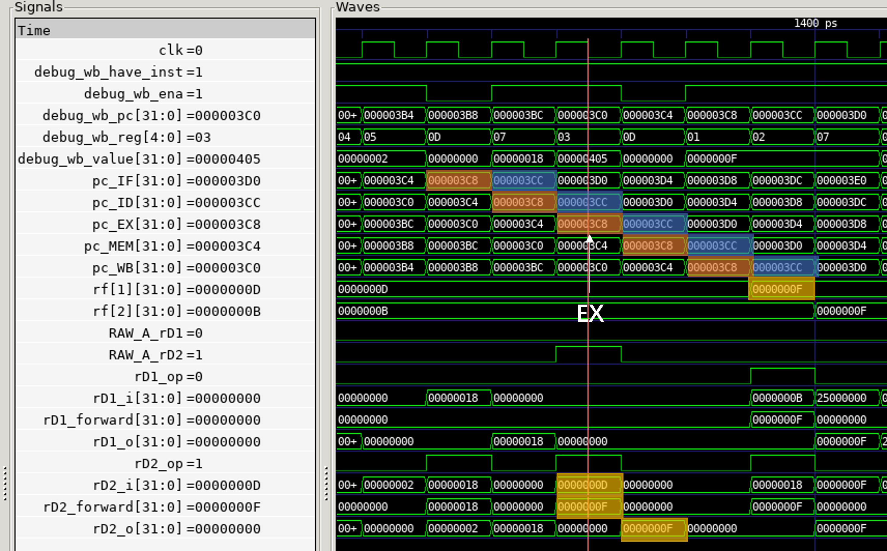
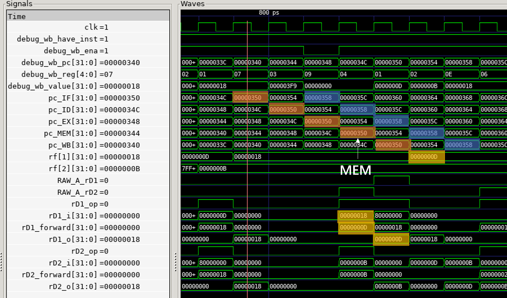
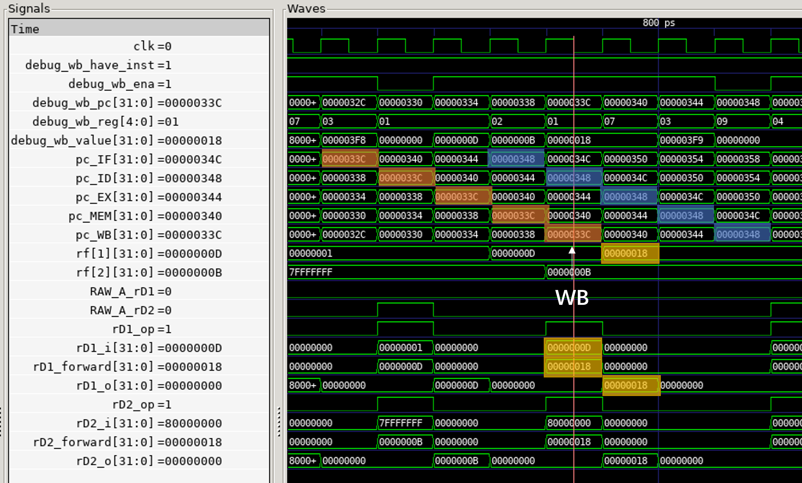
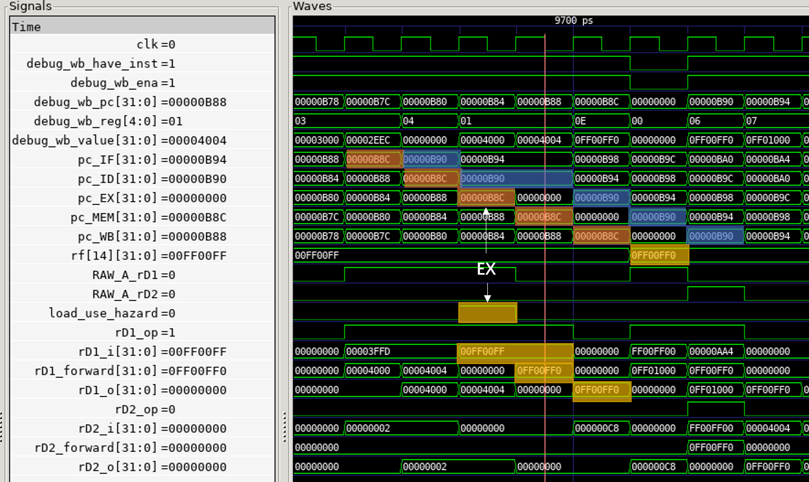
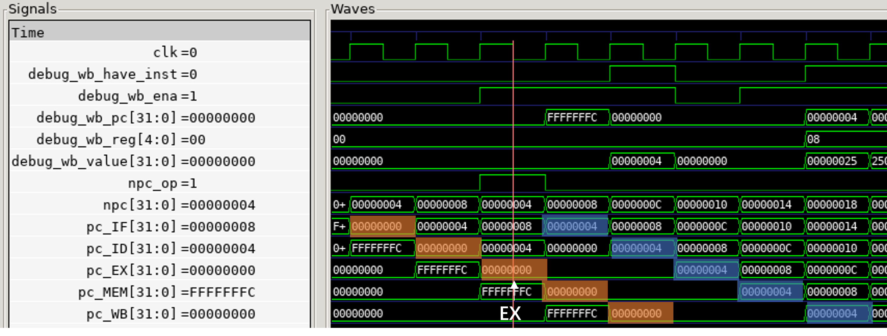

# 2.4 流水线 CPU 仿真及结果分析

（要求：包含数据冒险、控制冒险的仿真截图，以及结果分析）

（找冒险的办法：查看 start 的波形，找冒险检测器 HAZARD_DETECTION 的标志信号，就可以找到相应的数据冒险；至于控制冒险，B 型和 jal、jalr 是必定涉及的，也很好找。）

通过 pc_IF，pc_ID，pc_EX，pc_MEM，pc_WB 可以看到指令在数据通路中的流动。

## RAW - A 型数据冒险（相邻）

```asm
000003c8 <test_1035>:
     3c8:	00f00093          	addi	x1,x0,15
     3cc:	00100133          	add	x2,x0,x1
     3d0:	00f00393          	addi	x7,x0,15
     3d4:	40b00193          	addi	x3,x0,1035
     3d8:	e8711ce3          	bne	x2,x7,270 <fail>
     3dc:	00140413          	addi	x8,x8,1
     3e0:	fffff0b7          	lui	x1,0xfffff
     3e4:	0080a023          	sw	x8,0(x1) # fffff000 <_end+0xffffaf90>
     3e8:	000f80e7          	jalr	x1,0(x31)
```

关注 pc = 3c8 和 pc = 3cc，与 x1 有关。



可以看到 x1 在 pc = 3c8 的指令的 WB 阶段结束后，值变为 0000 000f；

而 pc = 3cc 的指令的 EX 阶段就需要使用到 x1 了，而 x1 的值仍然是原来的 0000 000d，于是就需要使用前递来解决问题。

注意到 pc = 3c8 的指令在 EX 阶段时，pc = 3cc 的指令在 ID 阶段；

此时，冒险检测器检测到发生冒险，并对 rD2 进行前递：在 ID/EX 寄存器内，rD2_i = 0000 000d，这是原本的 x1 的值；

前递来的 rD2_forward = 0000 000f，自然需要选取前递的值作为输出（rD2_op = 1）。

故在 pc = 3cc 的指令到达 EX 阶段时，从 ID/EX 寄存器得到的 rD2_o 是 0000 000f，成功完成了前递，解决了数据冒险。

## RAW - B 型数据冒险（间隔一条）

```asm
0000034c <test_1020>:
     34c:	00000213          	addi	x4,x0,0
     350:	00d00093          	addi	x1,x0,13
     354:	00b00113          	addi	x2,x0,11
     358:	00208733          	add	x14,x1,x2
     35c:	00070313          	addi	x6,x14,0
     360:	00120213          	addi	x4,x4,1 # 1 <_start+0x1>
     364:	00200293          	addi	x5,x0,2
     368:	fe5214e3          	bne	x4,x5,350 <test_1020+0x4>
     36c:	01800393          	addi	x7,x0,24
     370:	3fc00193          	addi	x3,x0,1020
     374:	ee731ee3          	bne	x6,x7,270 <fail>
```

关注 pc = 350 和 pc = 358，与 x1 有关。



可以看到 x1 在 pc = 350 的指令的 WB 阶段结束后，值变为 0000 000d；

而 pc = 358 的指令的 EX 阶段就需要使用到 x1 了，而 x1 的值仍然是原来的 0000 0018，于是就需要使用前递来解决问题。

注意到 pc = 350 的指令在 MEM 阶段时，pc = 358 的指令在 ID 阶段；

此时，冒险检测器检测到发生冒险，并对 rD1 进行前递：在 ID/EX 寄存器内，rD1_i = 0000 0018，这是原本的 x1 的值；

前递来的 rD1_forward = 0000 000d，自然需要选取前递的值作为输出（rD1_op = 1）。

故在 pc = 358 的指令到达 EX 阶段时，从 ID/EX 寄存器得到的 rD1_o 是 0000 000d，成功完成了前递，解决了数据冒险。

## RAW - C 型数据冒险（间隔两条）

```asm
00000334 <test_1017>:
     334:	00d00093          	addi	x1,x0,13
     338:	00b00113          	addi	x2,x0,11
     33c:	002080b3          	add	x1,x1,x2
     340:	01800393          	addi	x7,x0,24
     344:	3f900193          	addi	x3,x0,1017
     348:	f27094e3          	bne	x1,x7,270 <fail>
```

关注 pc = 33c 和 pc = 348，与 x1 有关。



可以看到 x1 在 pc = 33c 的指令的 WB 阶段结束后，值变为 0000 0018；

而 pc = 348 的指令的 EX 阶段就需要使用到 x1 了，而 x1 的值仍然是原来的 0000 000d，于是就需要使用前递来解决问题。

注意到 pc = 33c 的指令在 WB 阶段时，pc = 348 的指令在 ID 阶段；

此时，冒险检测器检测到发生冒险，并对 rD1 进行前递：在 ID/EX 寄存器内，rD1_i = 0000 000d，这是原本的 x1 的值；

前递来的 rD1_forward = 0000 0018，自然需要选取前递的值作为输出（rD1_op = 1）。

故在 pc = 348 的指令到达 EX 阶段时，从 ID/EX 寄存器得到的 rD1_o 是 0000 0018，成功完成了前递，解决了数据冒险。

## 载入 - 使用型数据冒险

```asm
00000b78 <test_12012>:
     b78:	000031b7          	lui	x3,0x3
     b7c:	eec18193          	addi	x3,x3,-276 # 2eec <test_37035+0x5dc>
     b80:	00000213          	addi	x4,x0,0
     b84:	000040b7          	lui	x1,0x4
     b88:	00408093          	addi	x1,x1,4 # 4004 <tdat_lw2>
     b8c:	0040a703          	lw	x14,4(x1)
     b90:	00070313          	addi	x6,x14,0
     b94:	0ff013b7          	lui	x7,0xff01
     b98:	ff038393          	addi	x7,x7,-16 # ff00ff0 <_end+0xfefcf80>
     b9c:	ec731a63          	bne	x6,x7,270 <fail>
     ba0:	00120213          	addi	x4,x4,1 # 1 <_start+0x1>
     ba4:	00200293          	addi	x5,x0,2
     ba8:	fc521ee3          	bne	x4,x5,b84 <test_12012+0xc>
```

关注 pc = b8c 和 pc = b90，与 x14 有关。



复习处理方式：1) 停顿，插入气泡（PC，IF/ID 不变；ID/EX 置 0）；2) 前递。

首先可以看到 x14 在 pc = b8c 的指令的 WB 阶段结束后，值变为 0ff0 0ff0，同时这个值要等到 MEM 阶段才会从 dram 里读出；

注意到 pc = b8c 的指令在 EX 阶段时，pc = b90 的指令在 ID 阶段；

此时，冒险检测器检测到发生载入 - 使用型数据冒险，故停顿，插入气泡：

- PC，IF/ID 不变：可以看到 pc_IF = 0000 0B94 保持了两个周期，pc_ID = 0000 0b90 也保持了两个周期；
- ID/EX 置 0：pc_EX 被归 0，这样 pc = b90 的指令就会被停下一个周期。

注意到 pc = b8c 的指令在 MEM 阶段时，pc = b90 的指令仍在 ID 阶段，此时已经从 dram 中读出 0ff0 0ff0 了。

对 rD1 进行前递：在 ID/EX 寄存器内，rD1_i = 00ff 00ff，这是原本的 x14 的值；

前递来的 rD1_forward = 0ff0 0ff0，自然需要选取前递的值作为输出（rD1_op = 1）。

故在 pc = b90 的指令到达 EX 阶段时，从 ID/EX 寄存器得到的 rD1_o 是 0ff0 0ff0，成功完成了前递，解决了载入 - 使用型数据冒险。

## 控制冒险

```asm
00000000 <_start>:
       0:	0040006f          	jal	x0,4 <reset_vector>

00000004 <reset_vector>:
       4:	02500413          	addi	x8,x0,37
       8:	01841413          	slli	x8,x8,0x18
       c:	fffff0b7          	lui	x1,0xfffff
      10:	0080a023          	sw	x8,0(x1) # fffff000 <_end+0xffffaf90>
      14:	27c00fef          	jal	x31,290 <n1_add_test>
      18:	00000013          	addi	x0,x0,0
```

关注 pc = 0 的 jal 指令：



复习处理方式：静态分支预测，总是预测不跳转；清除后二条指令，即 flush IF/ID，ID/EX。

pc = 0 的 jal 指令，当移动到 EX 阶段，由于是 jal 指令，故控制信号 npc_op 被赋值为 1，作为跳转的标志；

此时，冒险检测器检测到发生控制冒险，清除后二条指令，即 flush IF/ID，ID/EX，于是在下一个周期，pc_EX，pc_ID 就被清为 0 了。

并且，NPC 的 npc 也被修正为 4，于是在下一个周期，PC 的 pc 值就被修正为 4 了。

（PS：在想要是 imm = pc + 4 的话是不是就别跳转了，就如同数据冒险中 x0 不需要被前递一样）

pc = 14 的 jal 指令也是同理。

