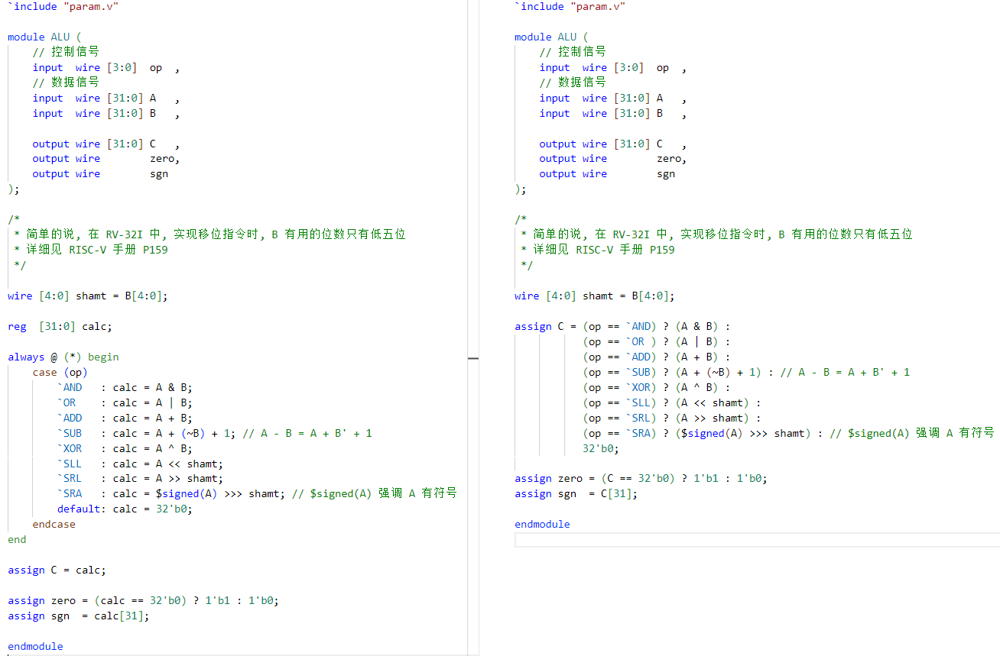
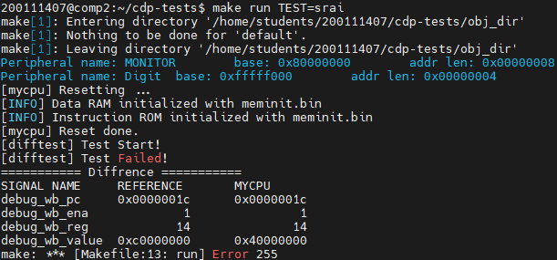
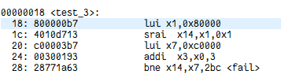
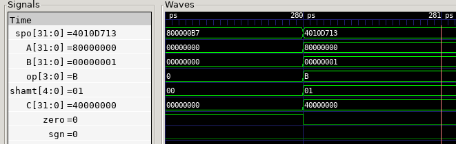
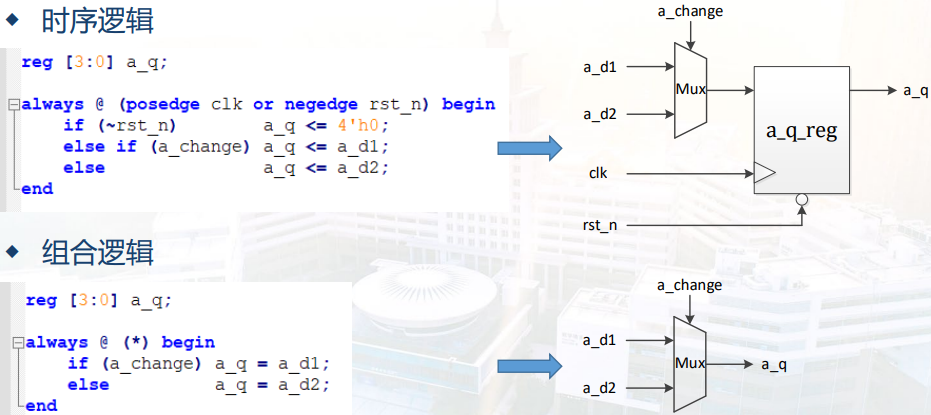

# 3.1 ALU 模块设计的细微差别



## 如何发现

在实现单周期上板之后，为了测试最高频率，需要将代码优化，故而将大多数的 reg 类型的变量修正为了 wire 类型，同时将大量的 always 块修改为 assign 和三目运算符。本来预期可以达到更高的频率，但是令人遗憾的是，经过这样的修改后，连单周期的最低要求 25MHz 也达不到，上板 trace 的结果只显示到 2500 0010，并没有到预期的 2500 0018。

针对修改前后的差别经行漫长的上板排查后，终于定位到 ALU 上，只需要把 ALU 修改为原来的样式就可以跑到 2500 0018；此外，将 assign 和三目的组合去运行在线 trace 也无法通过所有测试，没有通过的指令是 sra 和 srai。


运行 srai 的具体测试，通过查看反汇编和波形，发现运算出错的具体情况，本来应该进行的算术右移变成了逻辑右移：A = 8000 0000，B = 01，即 8000 0000 算术右移 1 位，结果本应该是c000 0000，但是结果却是 4000 0000。







即使是查看波形，也只能得出计算出错的结论，并不能带来更多的成果（毕竟算错了就是算错了）。

即使是调整 `SRA 在三目中的位置也无济于事。

已经知道了导致错误的表层原因，却不知道深层的原因。

## 理论解释

在老师的指点下，意识到三目运算是一种变种的 if-else 语句，以及理解了 case 语句和 if-else 语句的差别。

|            |       case       | if-else  |
| :--------: | :--------------: | :------: |
|   逻辑上   | 各分支间无优先级 | 有优先级 |
| 运行时间上 |     并行判断     | 串行判断 |

那么在判断到 op == `SRA 时，在时序上就可能出现问题，导致错误；

或者说，在实现的时候，if-else 的电路实现是很长的一条通路，这样是不好的。

另外，简单的把 reg 改为 wire 并不会起到实际的作用，因为不和时序逻辑相关的 reg，在综合时还是会被综合为连线。



所以之前的优化都是无效的。

## 额外参考

- [if-else写法和case写法在底层逻辑上实现的差异_StrangerZhou1的博客-CSDN博客](https://blog.csdn.net/m0_51261356/article/details/112907353)

- [SoC芯片设计——为什么使用assign语句，来避免使用if-else或者case来设计电路。_摆渡沧桑的博客-CSDN博客_用assign语句设计四选一选择电路](https://weivid.blog.csdn.net/article/details/108825998)

第一个很好的支持了上面的说法；

第二个参考我不好说，用了他的办法没啥效果，错了还是错了，不懂。

```verilog
wire op_sra = (op == `SRA);
wire op_and = (op == `AND);
wire op_or  = (op == `OR);
wire op_add = (op == `ADD);
wire op_sub = (op == `SUB);
wire op_xor = (op == `XOR);
wire op_sll = (op == `SLL);
wire op_srl = (op == `SRL);

assign C = (
           ({32{op_sra}} & ($signed(A) >>> shamt) ) |
           ({32{op_and}} & (A & B)                ) |
           ({32{op_or}}  & (A | B)                ) |
           ({32{op_add}} & (A + B)                ) |
           ({32{op_sub}} & (A + (~B) + 1)         ) |
           ({32{op_xor}} & (A ^ B)                ) |
           ({32{op_sll}} & (A << shamt)           ) |
           ({32{op_srl}} & (A >> shamt)           )
);
```

