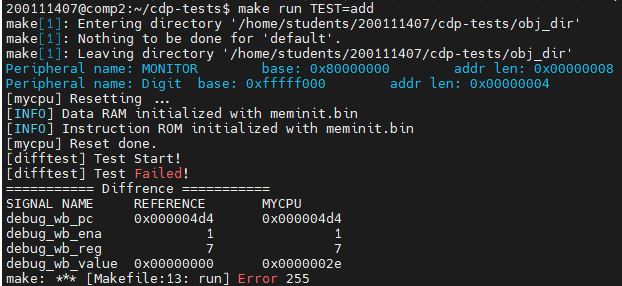
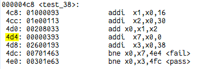

# 3.2 检测数据冒险的判断条件

## 如何发现

```verilog
// 数据冒险: RAW

// RAW - A 相邻
wire RAW_A_rD1 = (wR_EX  == rR1_ID) && rf_we_EX  && rD1_used && wR_EX;
wire RAW_A_rD2 = (wR_EX  == rR2_ID) && rf_we_EX  && rD2_used && wR_EX;

// RAW - B 间隔一条
wire RAW_B_rD1 = (wR_MEM == rR1_ID) && rf_we_MEM && rD1_used && wR_MEM;
wire RAW_B_rD2 = (wR_MEM == rR2_ID) && rf_we_MEM && rD2_used && wR_MEM;

// RAW - C 间隔两条
wire RAW_C_rD1 = (wR_WB  == rR1_ID) & rf_we_WB  && rD1_used && wR_WB;
wire RAW_C_rD2 = (wR_WB  == rR2_ID) & rf_we_WB  && rD2_used && wR_WB;
```

指导书上，关于 RAW 冒险的三种情况的判断条件，只有前三个被提及，分别是寄存器（号）和 wR 有对应关系，RF 可写，以及寄存器确实被使用。但是仅凭借这三个条件，并不能成功的通过 trace。

联系到计算机组成原理课上所学，尝试为其添加了 wR 不可为 0 的判断条件，也就是如果相关联的寄存器是 x0 的话，就不构成数据冒险；加上该条件后就可以通过 trace。

如果相关联的寄存器是 x0，确实不构成数据冒险的条件；但是为什么不加上这个判断条件就无法通过呢？

## 理论解释

浅显的考虑一下，即使是前递也是可以前递回 0 的吧？但是实际的情况并不是这样。

RF 可以保证若 wR 是 0 ，wD 不管为何值都只能写回 0，即 wD 本身不一定是 0，例如：（假设 x1 = 1，x3 = 3）

```asm
sub x0, x1, x3
```

写回的 wR 是 -2，但是被 RF 中检测出来并强制写回 0 了。但是在前递的时候是没有这样的判断的，因此需要加上某种判断，可以是从一开始就判断不构成数据冒险，也可以是在后面判断 wR 为 0 则不前递，或者前递 0，都是可以的，但显然放在最开始是最合适的。

## 实践理论

不加上 wR 不可为 0 的判断条件，测试 add 指令。



查看反汇编：



可知 x1 = 16，x2 = 30；pc = 4d0 的指令 x0 被写回的结果 wD = 46，即 2e(16 进制)，那么 x7 就会接收到这个前递的值，从而计算错误，故而得出错误的结果 2e。

和上面的解释匹配的很好。
